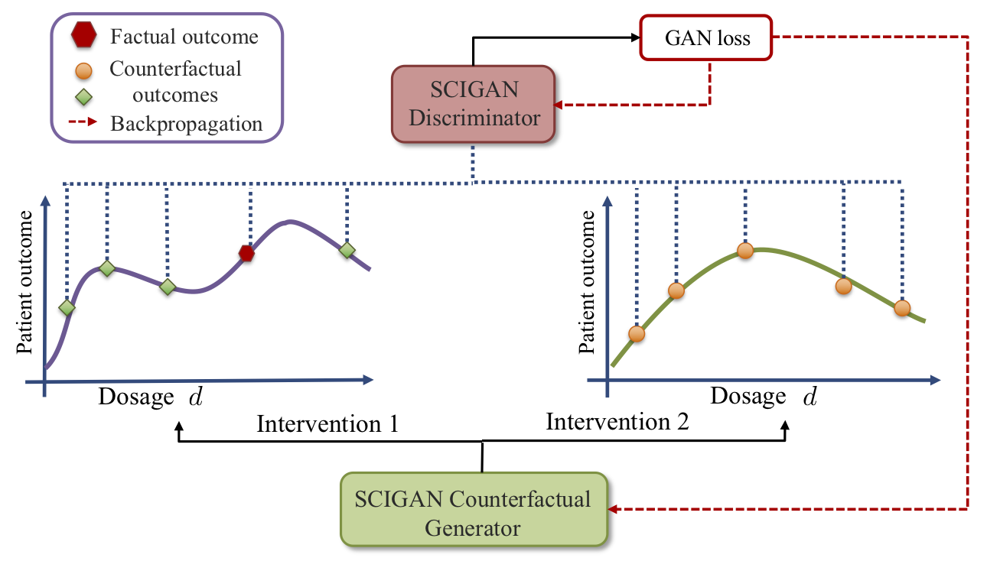

# [Estimating the Effects of Continuous-valued Interventions using Generative Adversarial Networks](https://arxiv.org/abs/2002.12326)

### Ioana Bica, James Jordon, Mihaela van der Schaar

#### Neural Information Processing Systems (NeurIPS) 2020

Code Author: Ioana Bica (ioana.bica95@gmail.com)

## Introduction 

SCIGAN is a causal inference method for estimating the effects of continuous-valued interventions, such as treatments 
associated with a dosage parameter, from observational data. SCIGAN is a flexible model that builds on the framework
of Generative Adversarial Networks (GANs) to learn the distribution of the unobserved counterfactuals. 

As illustrated in the following figure, the SCIGAN generator estimates the individualized dose-response curves. We then 
define a discriminator that acts on a finite set of points from each generated curve and identifies the factual outcomes 
from the set of factual outcomes and generated counterfactual ones. The intuition is that if a counterfactual generator 
and discriminator are trained adversarially, then the generator can fool the discriminator (i.e. the discriminator will 
not be able to correctly identify the factual outcome) by generating counterfactuals according to their true distribution.



 
The generated counterfactual outcomes are then used to lean an inference model, using standard supervised methods, capable of 
estimating these counterfactuals for a new sample. 


## Dependencies

The model was implemented in Python 3.6. The following packages are needed for running the model:

- numpy==1.18.2

- pandas==1.0.4

- scipy==1.1.0

- scikit-learn==0.22.2

- tensorflow-gpu==1.15.0

## Running and evaluating the model:

Download the TCGA dataset from [here](https://drive.google.com/file/d/1P-smWytRNuQFjqR403IkJb17CXU6JOM7/view?usp=sharing) and add it to the 'datasets/' directory.

The nature of the treatment-effects estimation problem does not allow for meaningful evaluation on real-world datasets due to the inability to observe the
counterfactuals. Thus, to evaluate our model we introduce a new semi-synthetic data simulation 
for use in the continuous intervention setting. The details can be found in 'data_simulation.py'.

To train and evaluate SCIGAN on the semi-synthetic datasets obtained from TCGA, run the following command with the chosen command line arguments. 

```bash
python test_SCIGAN.py
```
```
Options :
   --num_treatments	              # Number of different treatments to simulate (current code supports up to 3 treatments).  
   --treatment_selection_bias	  # Parameter controlling the amount of treatment selection bias in the data simulation. A lower value indicates less bias.
   --dosage_selection_bias        # Parameter controlling the amount of dosage selection bias in the data simulation. Takes values >1. A lower value indicates less bias.
   --model_name                   # Model name (used for saving the model).
   --batch_size                   # Batch size. 
   --h_dim                        # Dimension of hidden fully connected layers. 
   --h_inv_eqv_dim                # Dimension of invariant/equivariant layers.
   --num_dosage_samples           # Number of dosage samples given as input to the discriminator for each treatment.
   --alpha                        # Parameter controlling the trade-off between the supervised loss and the discriminator loss for training the generator. 
```

Outputs:

   - Evaluation metrics: mean integrated squared error (MISE), dosage policy error (DPE) and policy error (PE).  
   
   - Trained SCIGAN model saved in the 'saved_models/' directory. 

#### Example usage

```
python test_SCIGAN.py --num_treatments=3 --treatment_selection_bias=2.0 --dosage_selection_bias=2.0 --model_name="scigan_test" --batch_size=128 --h_dim=64 --h_inv_eqv_dim=64 --num_dosage_samples=5 --alpha=1.0
```
 
 
### Reference

If you use this code, please cite:

```
@article{bica2020scigan,
  title={Estimating the Effects of Continuous-valued Interventions using Generative Adversarial Networks},
  author={Bica, Ioana and Jordon, James and van der Schaar, Mihaela},
  journal={Advances in neural information processing systems (NeurIPS)},
  year={2020}
}
```