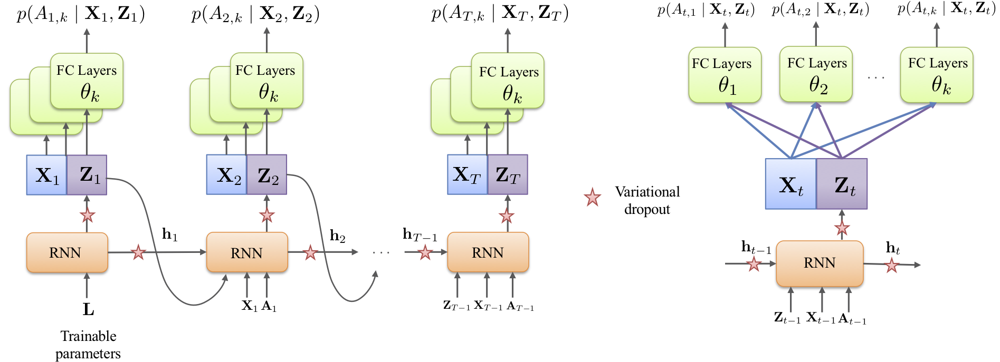

# [Time Series Deconfounder: Estimating Treatment Effects over Time in the Presence of Hidden Confounders](https://arxiv.org/abs/1902.00450)
### Authors: Ioana Bica, Ahmed M. Alaa, Mihaela van der Schaar
 
#### International Conference on Machine Learning (ICML) 2020

Code Author: Ioana Bica (ioana.bica95@gmail.com)

The Time Series Deconfounder is a causal inference method that enables the estimation of treatment 
effects over time from observational data in the presence of hidden confounders. 

The Time Series Deconfounder consists of two steps:

- Step 1: Fit factor model over time to infer substitutes for the hidden confounders. Proposed architecture 
for factor model: recurrent neural network with multitask output and variational dropout as illustrated in 
the following figure:


- Step 2: Augment the observational dataset with the inferred substitutes for the hidden confounders and then fit 
existing outcome model to estimate individualized treatment effects over time. This implementation uses 
Recurrent Marginal Structural Networks (R-MSN) as the outcome model. The implementation 
for R-MSN is adapted from here: https://github.com/sjblim/rmsn_nips_2018.

## Dependencies

The model was implemented in Python 3.6. The following packages are needed for running the model:

- numpy==1.18.2

- pandas==1.0.4

- scipy==1.1.0

- scikit-learn==0.22.2

- tensorflow-gpu==1.15.0

- tqdm==4.32.1

## Running the model

To be able to validate and evaluate the Time Series Deconfounder, we simulate observational datasets where 
we control the amount of hidden confounding present through the parameter gamma, where 0 <= gamma < 1. 

To train and evaluate the Time Series Deconfounder on a simulated data, run the following command with the chosen command line arguments. 

```bash
python main_time_series_deconfounder.py
```
```
Options :
		--gamma	                             # Parameter controlling the amount of hidden confounding present in the simulated dataset. 
		--num_simulated_hidden_confounders   # Dimensionality of the simulated hidden confounders. 
		--num_substitute_confounders         # Dimensionality of the inferred substitutes for the hidden confounders.
		--results_dir                        # Directory for saving the results.
		--exp_name                           # Experiment name.
		--b_hyperparm_tuning                 # Boolean flag for hyperparameter tuning. 
```

Outputs:

- root mean squared error (RMSE) for the outcome model trained without handling the bias from the hidden confounders. 

- RMSE for the outcome model trained with the inferred substitutes for the hidden confounders. 

- Dataset file containing the simulated observational dataset and the inferred latent variables that can act as substitutes for the hidden confounders. 

- Trained Recurrent Marginal Structural Networks (R-MSN) models.

### Example usages

To test the Time Series Deconfounder, run (this will use default settings for the hyperparameters):
```
python main_time_series_deconfounder.py --gamma=0.6 --exp_name='test_tsd_gamma_0.6' \
--num_simulated_hidden_confounders=1 --num_simulated_hidden_confounders=1  --results_dir='results'
```

To perform hyperparameter optimization and test the Time Series Deconfounder , run:
```
python main_time_series_deconfounder.py --gamma=0.6 --exp_name='test_tsd_gamma_0.6' \
--num_simulated_hidden_confounders=1 --num_substitute_hidden_confounders=1  \
--results_dir='results' --b_hyperparm_tuning=True
```

For the results in the paper, hyperparameter optimization was run (this can take about 3-4 hours on an
NVIDIA Tesla K80 GPU). However, similar results can be obtained with the default hyperparameters. 
 
The results in Section 6 in the paper are obtained by setting --num_simulated_hidden_confounders=1 and 
then inferring latent variables that can act as substitues for the hidden confounders of dimensionalities D_Z = 1 (--num_substitute_hidden_confounders=1) and 
D_Z = 5 (--num_substitute_hidden_confounders=5). 

Moreover, Appendix E contains results for --num_simulated_hidden_confounders=3 and for 
inferring latent var substitutes of dimensionalities D_Z=1 (--num_substitute_confounders=1), D_Z=3 (--num_substitute_confounders=3) and 
D_Z=5 (--num_substitute_confounders=5). The value for the parameter gamma (which indicates the degree of 
hidden confounding) is selected from {0.0, 0.2, 0.4, 0.6, 0.8}.

### Reference

If you use this code, please cite:

```
@article{bica2020tsd,
  title={Time Series Deconfounder: Estimating Treatment Effects over Time in the Presence of Hidden Confounders},
  author={Bica, Ioana and Alaa, Ahmed M and van der Schaar, Mihaela},
  journal={International Conference on Machine Learning},
  year={2020}
}
```