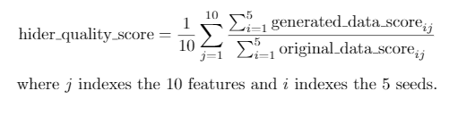

# NeurIPS 2020 "Hide-and-Seek Privacy Challenge" Competition

#### This repository contains:

* **Baseline code** for our 2 hider and 2 seeker algorithms.
* **Documentation** for the competition. This `README` file - detailing setup and submission instructions. A [PDF](./data_and_baselines_description.pdf) outlining the baseline models and describing the data.
* **Submission template** (a.k.a. starting kit) to base your submissions on.
* **Competition backend code**, less relevant to the participants.

> Please note that this repository is shared with other van der Schaar lab code, the only directory relevant to the competition is this one ([`app/hide-and-seek`](./)).

#### Other resources:

* Paper introducing the challenge: https://arxiv.org/abs/2007.12087  
* General introduction and overview (including FAQs): https://www.vanderschaar-lab.com/privacy-challenge/  
* CodaLab challenge page: https://competitions.codalab.org/competitions/25312  
* van der Schaar Lab contacts: nm736@cam.ac.uk, james.jordon@wolfson.ox.ac.uk, e.s.saveliev@gmail.com
* Slack Workspace: https://join.slack.com/t/hideandseekpr-fbc8582/shared_invite/zt-hnhara8n-1ESfxkzdFBxTpfhcMXQvUA


## Introduction
The best way to get an overview of the competition set-up is to read the [paper](https://arxiv.org/abs/2007.12087) introducing the challenge. Please note that there is **one point of update** to this paper, which is:
* **Section 2.2 / Evaluating Hiders** includes task *(3) time-series classification*. This is no longer part of the competition, and can be ignored.


## Getting Started

1. **Sign up** by following the steps [here](https://www.vanderschaar-lab.com/privacy-challenge/#enter).
2. **Clone** this repository.
3. **Download** the data from the *Google Drive link you received in your acceptance email* and save it to `starting_kit/data/train_longitudinal_data.csv`.
4. **Install** dependencies using your favourite package manager, using `requirements.txt`.
5. (Optional) **Check** your environment is setup correctly by running `starting_kit/main.py` (note this will take a while to run):
```bash
$ cd starting_kit
$ python main.py
```

Once you have all the necessary packages installed and the data downloaded, you can start developing your algorithms.


## Contents of the Repository
```
.
├── common/                             # Shared code, sometimes linked to via symlinks.
├── competition/                        # Competition backend code, including the scoring program.
├── competitions-v1-compute-worker/     # Compute worker code, used for running the competition.
├── starting_kit/                       # Starting kit - key directory for the participants.
│   ├── Dockerimage                     # File used to specify docker image for solutions to run in.
│   ├── data/                           # Location to put the data file(s) in.
│   ├── dockerfiles/                    # Dockerfile examples and a helper bash script for building docker containers. 
│   ├── examples/                       # Example solutions code.
│   │   ├── hider/                      # Example hiders.
│   │   └── seeker/                     # Example seekers.
│   ├── hider.py                        # Hider template module, containing the hider function.
│   ├── main.py                         # Script for testing solutions locally.
│   ├── make_hider.sh                   # Helper bash script for zipping up a hider solution.
│   ├── make_seeker.sh                  # Helper bash script for zipping up a seeker solution.
│   ├── seeker.py                       # Seeker template module, containing the seeker function.
│   └── utils/                          # Utilities code folder, can be used by code imported in solutions.
├── tests/                              # Competition-related unit tests.
├── data_and_baselines_description.pdf  # Data an baselines explanation PDF.
├── pyproject.toml                      # pyproject file for the competition codebase.
├── README.md                           # This README.
└── requirements.txt                    # The requirements file for local debugging.
```

> Please note that this repository uses symlinks in several places, make sure these work correctly once you have cloned the repo.


## Data

### AmsterdamUMCdb
The "public" subset of the Amsterdam dataset (`train_longitudinal_data.csv`) is provided in the *Google Drive link you received in your acceptance email*. Preprocessing logic used by the competition backend is found in:

* `starting_kit/solutions.py`, `load_data(...)` function.
* `starting_kit/data_preprocess.py` 

The data in the CSV file, of shape `[num_rows, len( [admissionid, time, ...features...] )]`, is reshaped to `[num_examples, max_seq_len, num_features]` for use in this competition. Additional preprocessing and imputation is also provided.

Note that the `max_seq_len` is set to `100` in this competition, so the longer time series are truncated. The shorter time series are padded with `-1`s, and a padding mask (of `bool` values, of same shape) is also returned.

See `data_preprocess.py` module for full details on preprocessing.

### Stocks
An alternative public dataset of stocks is available in `competition/public_data/public_stock_data.txt` but no preprocessing logic is provided for this.


## Local Debugging
To assist with local debugging of solutions, `starting_kit/main.py` script is provided. This emulates the competition scoring logic, and plays the hider from `starting_kit/hider.py` against the seeker from `starting_kit/seeker.py`. For full details on this script, run:
```bash
$ cd starting_kit
$ python main.py --help
```


## Submitting your Algorithm
The starting kit ([`starting_kit`](./starting_kit) directory) contains 4 example submissions corresponding to the 4 baselines; a script that can be used to test your submission locally before submitting it to CodaLab ([`main.py`](./starting_kit/main.py)), and [`hider.py`](./starting_kit/hider.py), [`seeker.py`](./starting_kit/seeker.py) template solution modules.

> This section references all paths from within the `starting_kit` directory. 

> Note that although the steps below refer to the `utils` folder, additional logic can be saved in differently named folders (e.g. you may wish to maintain a `seeker_utils` and `hider_utils` folder if you plan on submitting to both tracks), just make sure they're copied and zipped.

### Submitting a Hider
To submit a **hider** model:

1. **Replace** the logic inside `hider.py` with your algorithm's logic. Additional logic may be added to `utils`.
2. **Run** `main.py` locally to make sure everything works as expected. If any errors arise, debug them. If they persist, feel free to ask in the competition [Slack workspace](https://join.slack.com/t/hideandseekpr-fbc8582/shared_invite/zt-hnhara8n-1ESfxkzdFBxTpfhcMXQvUA).
3. Either:
    1. **Copy**:
        * `hider.py`, 
        * `utils/`, 
        * `examples/`, if used,
        * `Dockerimage` file, if used (see `README` section on Docker below)
    
        into a new folder (e.g. `<team_name>_hider_submission`).
    
    2. **Zip** the contents of the new folder (so that *the root* of your zip file contains `hider.py` etc.).

    or:

    * Use `make_hider.sh` (make changes to, if needed) bash script and run it to automatically create a zip file.
4. **Submit** the zipped folder on [CodaLab](https://competitions.codalab.org/competitions/25312#participate-submit_results).

**What do I need in `hider.py`?**

The module must export a function `hider(input_dict)`. `input_dict["data"]` will be a numpy array of shape `(num_examples, max_seq_len, num_features)`. This will be raw, *unprocessed* data (i.e. containing NaNs and unscaled). `hider` should return a numpy array of shape `(num_examples, max_seq_len, num_features)` (i.e. the same shape as its input). This data may contain NaNs. Algorithms are expected to be able to flexibly accept arrays with varying sizes.

Random seed and a padding mask are also provided in `input_dict`. For full details, see the docstrings in the template `hider.py`.

Seekers will receive the raw, unprocessed output from hiders as input. The two quality checks (feature prediction and one-step-ahead prediction) will be performed after first calling `data_preprocess.data_preprocess(...)`.

> For faster runtime of hiders on the platform, you can provide an integer in range `[0, 5]` as the last item returned (e.g. like `return generated_data, generated_padding_mask, 3`) to use as the number of seeds in the hider evaluation step (otherwise this will be the default `5`). Note that in competition evaluation, 5 seeds will be used in evaluation, and this case needs to be passed by the hiders. Refer also to the related FAQ below.

### Submitting a Seeker
To submit a **seeker** model:

1. **Replace** the logic inside `seeker.py` with your algorithm's logic. Additional logic may be added to `utils`.
2. **Run** `main.py` locally to make sure everything works as expected. If any errors arise, debug them. If they persist, feel free to ask in the competition [Slack workspace](https://join.slack.com/t/hideandseekpr-fbc8582/shared_invite/zt-hnhara8n-1ESfxkzdFBxTpfhcMXQvUA).
3. Either:
    1. **Copy**:
        * `seeker.py`, 
        * `utils/`, 
        * `examples/`, if used,
        * `Dockerimage` file, if used (see `README` section on Docker below)
    
        into a new folder (e.g. `<team_name>_seeker_submission`).
    
    2. **Zip** the contents of the new folder (so that *the root* of your zip file contains `seeker.py` etc.).

    or:

    * Use `make_seeker.sh` (make changes to, if needed) bash script and run it to automatically create a zip file.
4. **Submit** the zipped folder on [CodaLab](https://competitions.codalab.org/competitions/25312#participate-submit_results).

**What do I need in `seeker.py`?**

The module must export a function `seeker(input_dict)`. `input_dict["generated_data"]` will be a numpy array of shape `(num_examples, max_seq_len, num_features)`, containing the *raw* output of a hider. `input_dict["enlarged_data"]` will be a numpy array of shape `(2 x num_examples, max_seq_len, num_features)`, containing the data used to train the hider and an additional `num_examples` data rows not used to train the hider. `seeker` should return a numpy array of shape `(2 x num_examples,)` (i.e. a one-dimensional array of length `2 x num_examples`). The *i*th element of this output should contain the seeker's prediction about whether or not the *i*th element of `enlarged_data` was used in the training of the hider, being `1` if it was, and `0` if not.

Random seed and padding masks are also provided in `input_dict`. For full details, see the docstrings in the template `seeker.py`.

### Docker and Managing Dependencies

Dependencies for the solution are managed using Docker containers. If you are not familiar with Docker, have a look at the resources:

* [Introduction to Docker YouTube playlist](https://www.youtube.com/playlist?list=PLhW3qG5bs-L99pQsZ74f-LC-tOEsBp2rK)
* [Official *Getting Started* guide](https://docs.docker.com/get-started/)

The solutions are executed by the competition backend in their own docker container, to give the participants maximal control over the dependencies. Your submission zip archive may contain a file in the root named `Dockerimage`, containing only the name of a Docker image to pull from Docker Hub (a default example is provided as `starting_kit/Dockerimage`). If present, the submission will be run in this Docker image, otherwise the Docker image [`drshushen/hide-and-seek-codalab`](https://hub.docker.com/r/drshushen/hide-and-seek-codalab) (its Dockerfile can also be seen at [`competition/competition-docker/Dockerfile`](./competition/competition-docker/Dockerfile)) will be used.  To keep the data secret, the submission will be run without internet access, so make sure the image contains everything necessary. When providing your own Docker image, the code for your algorithm *does not* need to be mounted inside the Docker container.

Some examples and more information on creating a Docker image for your submission, see the contents of the [`starting_kit/dockerfiles`](./starting_kit/dockerfiles) folder.


## CodaLab Competition Setup
Please note the following about the CodaLab setup for this competition:

* The `stdout` and `stderr` generated by your *solution* will silenced, in order to prevent the leaking of the evaluation data.
* The exceptions generated by the solution code will be passed to the logs, but the exception message will be redacted. 
* Your solution will be played against all other submitted opponent solutions (hider vs seeker or vice versa). If none of these *"vs"* pairings return a reidentification score (e.g. due to failure of a seeker and/or hider involved), the final score cannot be computed. In that case, an "N/A" score will be assigned. The "N/A" score is set to dummy values `9.99` for hiders and `-9.99` for seekers, to avoid interfering with successful solutions on the scoreboard.  


## Re-scoring your submission
In order to re-compute your solution's score (which is based on running it against all other hiders or seekers), follow the instructions below. This is useful if your solution code hasn't changed, but there have been more submissions to the competition which your submission hasn't yet run against.

### Hiders
If you have a successful submission which had generated data and passed evaluation in a previous run, you may simply re-run the "vs seekers" scoring step by returning the string `"rescore"` from your `hider()` function, i.e.:
```python
def hider(input_dict):
    return "rescore"
```

### Seekers
Simply resubmit your solution zip exactly as before.


## Backend Hardware
The backend uses the NC6 (specs here: https://docs.microsoft.com/en-us/azure/virtual-machines/nc-series). It has NVIDIA driver 450 installed and the OS is Ubuntu 18.04. 


## Known Issues

* Currently the updating of your submission's score on CodaLab happens only upon the execution of your submission. When a new opponent submission is uploaded later, the score of your submission vs that new submission needs to be computed and incorporated. This only currently happens on the backend of the competition, and does not get reflected automatically on CodaLab. We will ensure to recalculate all the scores in the evaluation stage of the competition; and we may make this score update automatic if feasible. Currently, you will need to follow the instructions in the **"Re-scoring your submission"** section to update your solution's score.


---

## Frequently Asked Questions


#### What is the actual evaluation happening? Where is the classification task mentioned in the overview/proposal document?

We apologize for the confusion, but there is no classification task (as was described in the original competition proposal) in the final challenge. 

This is because the features we ultimately selected did not contain any categorical features. The quality checks will therefore be on feature prediction (10 features will be used, the IDs of which will be the same for all submissions, but these will remain unknown to participants). 

In theory, hider algorithms are expected to meet the minimum quality threshold for all features and we may, for the final evaluation, test more features than these 10.


#### What are you setting the “threshold” at?

The threshold is being set at 500%, (i.e. `generated_data_rmse < 5 * original_data_rmse`) for both feature prediction and one step ahead prediction. See equation:




#### It was mentioned in the overview/proposal document that seekers will get an ID of the hider model they are attacking, but this is not present in the code. Will this be provided at test time?

Although this was our initial intention, and after receiving hider submissions we intended to support this functionality, we have realised that the limited time remaining in the competition would create an unfair playing field for hider algorithms that choose to submit later, as they would have less time to be hacked. For this reason, this functionality will not be provided and seekers are expected to operate without knowledge of which hider algorithm they are attacking.


#### To what degree are we supposed to, or allowed to, tune models on the “public” data? Was TimeGAN trained on that dataset?

Importantly, the hider algorithm is **not a trained model**. Rather, it is a model and training procedure that will ingest training data (private) on our backend, and will then, at the end of training, be required to output some generated data. 

Pretraining a model on the public data is not permitted. The public data may be used to select hyperparameters (or hyperparameter search spaces) such as network depth, width, activation functions etc. 

We would like to make clear that ultimately it is our decision as to whether a model has been “over-tuned” to the public data. We will be inspecting top models carefully for compliance during the evaluation stage after the competition closes to submission.
